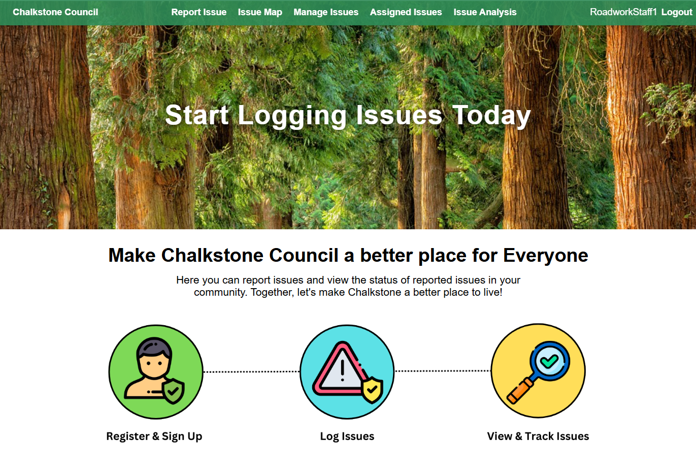
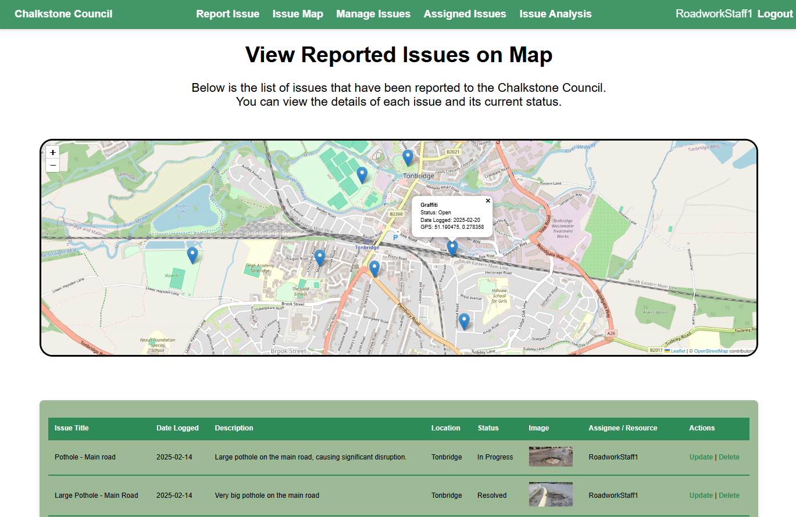

# Chalkstone Council Issue Reporting System



## Overview
The Chalkstone Council Issue Reporting System is a Django-based web application designed to help council staff and citizens log, analyse, and track issues related to public assets and services. The system enables users to report problems such as potholes, street lighting faults, graffiti, anti-social behavior, fly-tipping, and blocked drains.

## Features
- **Issue Reporting:** Users can submit new issues with descriptions, locations, and optional image uploads.
- **EXIF Data Extraction:** Automatically extracts GPS coordinates from uploaded images to map issue locations.
- **Issue Management:** Council staff can review, update, and resolve reported issues.
- **Internal Comments & Analysis:** Staff users can add internal notes and analysis to issues.
- **Sprint Planning & Kanban Board Support:** Tracks issue progress using Agile methodologies.
- **Excel Report Export:** Generates reports of issue analysis data in Excel format.

## GPS Interactive Map feature



## Installation

### Prerequisites
- Python 3.8+
- Django 4.0+
- PostgreSQL or SQLite
- Openpyxl (for Excel export)

### Setup Instructions
1. Clone the repository:
 
2. Create a virtual environment:
   ```bash
   python -m venv venv
   source venv/bin/activate  # On Windows use: venv\Scripts\activate
   ```
3. Install dependencies:
   ```bash
   pip install -r requirements.txt
   ```
4. Apply database migrations:
   ```bash
   python manage.py migrate
   ```
5. Create a superuser (for admin access):
   ```bash
   python manage.py createsuperuser
   ```
6. Start the development server:
   ```bash
   python manage.py runserver
   ```
7. Access the system at `http://127.0.0.1:8000/`

## Usage
- **Logging Issues:** Users can submit issues via a simple web form.
- **Managing Issues:** Council staff can update issue statuses, add internal comments, and track resolution progress.
- **Exporting Reports:** Download detailed Excel reports of issue analysis data.
- **Mapping Issues:** View issue locations on an interactive map.


## Contribution
If you'd like to contribute, please submit a pull request or open an issue.

